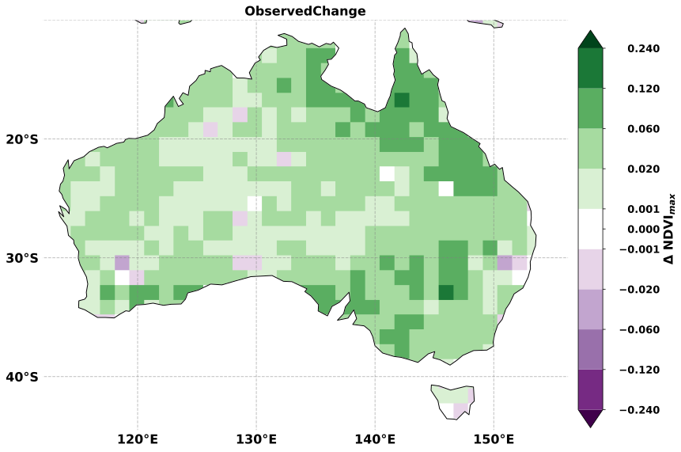
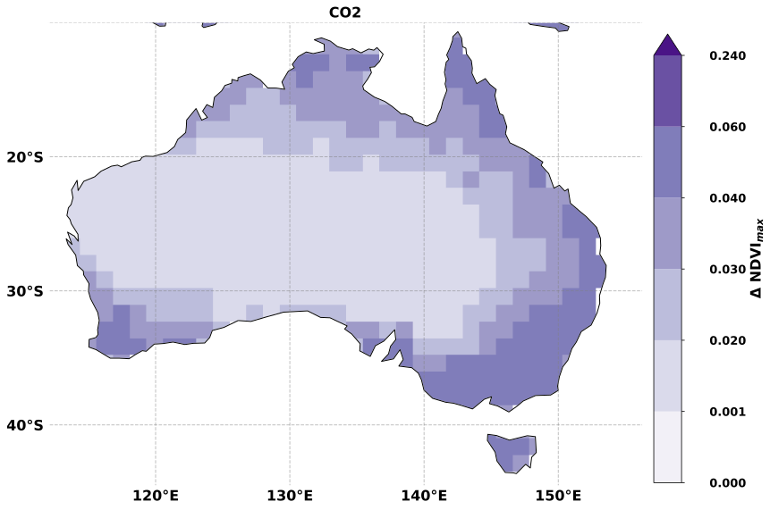
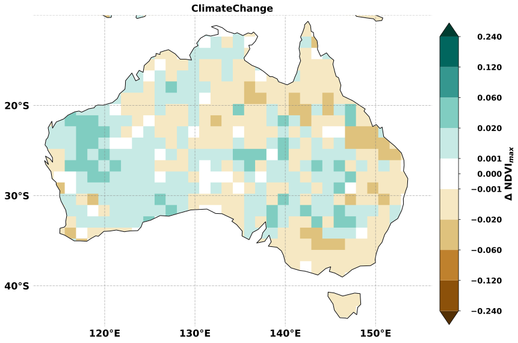
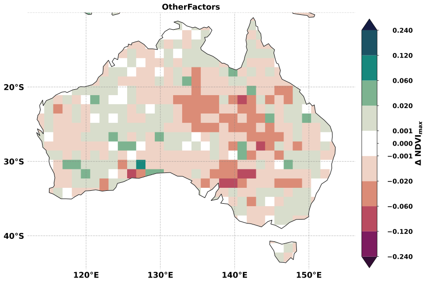

# Applying the TSS.RESTREND package to Netcdf spatial data


This folder gives and example of how TSS-RESTREND R package can be used to do analysis on netcdf format spatial data.  It uses a mix of python and R because that is the way I process data. The implementation here is not computationally efficient and massive performance gains can be using pythons dask+xarray+scikit-learn to compute statistics on the entire dataset to calculate the observed change, the CO2, the climate change and climate variability components.  It is broken up into 3 sections:

1. [Setup a programming environment](#l1)
2. [Performing a single TSS-RESTREND run](#l2)
3. [Performing multi-run ensemble statistics](#l3)

There are four netcdf files included in this repo, GIMMS derived NDVI (1982-2015), TERRACLIMATE derived precipitation (1960-2015), TERRACLIMATE derived temperature (1960-2015) and SYNMAP C4 vegetation fraction. To make the datasets small enough that they can be stored on git, they have all been down-sampled to approximately 25km and their spatial coverage has been limited to Australia. Example datasets are located in [data](data). They are included for demonstration purposes and should not be used for scientific analysis.  This example uses some custom python functions located in the [CustomFunctions](CustomFunctions) folder and will not run if the folder is missing.  

<a name="l1">
</a>

## 1. Setting up a programming environment


#### Building a python environment using conda ####

The following are instructions on how to setup a conda python programming environment in any Ubuntu based Linux distro including the Windows Subsystem for Linux (WSL).  Anaconda is available [here](https://www.anaconda.com/products/individual).  

```bash

#  etting up Conda environment for the python parts of this code
conda config --add channels conda-forge
conda update -n base -c defaults conda

# Setup the new environment. These steps are optional but provent conflicts with existing python enviroments
conda create --name tssr
conda activate tssr

# install the relevant packages
conda install dask xarray pandas matplotlib palettable cartopy seaborn ipdb numba bottleneck netCDF4 webcolors gitpython geopandas shapely rasterio cdo python-cdo ipython statsmodels

# Install other usefull commmand line utils. This is optional, but makes it easy to read netcdf files
sudo apt-get intall ncview

# Sometimes, R packages can fail to install on Ubuntu because libcurl is missing. To fix this
sudo apt install libcurl4-openssl-dev

```

#### Building an R programming environment ####

The latest version of R is available from [CRAN](https://cran.r-project.org/mirrors.html). The TSS.RESTREND package was built with [Rstudio](https://rstudio.com/products/rstudio/download/).

```R
# ========== Install dependincies ==========
install.packages(c("bfast", "broom", "RcppRoll", "forecast", "car", "rgl", "ggplot2", "mblm", "curl", "rjson", "optparse", "foreach", "lubridate")) #"libcurl",

# ========== Install TSS.RESTREND from cran ==========
install.packages("TSS.RESTREND")

# ========== To use the parallel option in the code ==========
install.packages("doSNOW")
```
The other option is to use this repo to build TSS-RESTREND. Rstudio project file TSS.RESTREND.Rproj is located [here](../TSS.RESTREND/)
```R
# The following packages are needed to build TSS.RESTREND in Rstudio
install.packages(c("devtools", "roxygen2"))

```
To rebuild the documentation of the package, it is also necessary to to install MikTeX from (https://miktex.org/).  

<a name="l2">
</a>

## 2. Performing a single TSS-RESTREND run 

To demonstrate how TSS-RESTREND can be applied to spatial data, this repo contains four scripts that, if run in order, will set-up the analysis, process the data, perform TSS-RESTREND on the data, reassemble the results into a netcdf file and save maps of the results.  The results will be equivalent to a single run from Burrell et al., (2020).  This example is split across four scripts that need to be run in order from S00 to S03.   

#### Setting up the meta data ####

The first script that needs to run is [S00_SetupMetadata.py](./S00_SetupMetadata.py).  This script saves a json file that is passed between all the following scripts with meta-data about the run. For this example we will use a coarsen value of 5 to speed up analysis and the defaults for all other arguments.  

```bash
# Run in console
python S00_SetupMetadata.py --coarsen 5
```

This script has six optional command line arguments:

 -  -h, --help      show help message and exit

 -  -c, --coarsen 	Int. The size of the box used to downscale data. Default = 0. Passing a larger coarsen values will speed up analysis at the cost of resolution.  The default of 0 means the analysis will occur at 25km of the demonstration datasets and will take many hours.  Passing value of 10 should downscales the data to 250km pixels which allow all four demo scripts to be run in less than 30 minutes.  

 -  -y, --yearly	When calculating TSS-RESTREND, report values in change per year not Total Change. Default is Total Change

 -  --maxacp    	Int. The maximum accumulation period in months. default = 12. See TSSRESTREND R package documentation. 

 -  --maxosp       	int. The maximum offset period in months. default = 4. See TSSRESTREND R package documentation. 

 -  --photo 		str, The photosynthetic pathway to fit for calculating the CO2 effect size. Possible arguments: {"C3andC4","C3","C4"}. Default is "C3andC4" which uses the demo SYNMAP C4 vegetation fraction.  

 -  -a, --archive	Archive existing infomation.json file rather than overwriting it. The existing infomation.json file is moved to ./results/archive/.  With some tweaks this could be used to allow for multiple runs without overwriting results.  


#### Reshape the demo netcdf data into two-dimensional csv files ####


R can be very slow when working with higher dimensional rasters. Using python to convert the 3D netcdf files to a 2D .csv file with the lat and long as the row name and each column being a time-step reduces overall computation time. Which files are processed is determined using the infomation.json file produced in the previous step.  [S01_processingnetcdf.py](S01_processingnetcdf.py) opens the demo vegetation, precipitation, temperature and C4 fraction netcdf files then creates 2 dimensional .csv files that can be read in by R.

```bash
# Run in console
python S01_processingnetcdf.py
```
This script produces four csv files in the [data](./data/) folder: demo_dataframe_ndvi.csv, demo_dataframe_ppt.csv, demo_dataframe_tmean.csv, demo_dataframe_C4frac.csv.  This script has one optional argument:

- --use_archived		Use this argument to redo archived infomation.json files. Must be an int which corresponds to the number of the desired ./data/archive/infomation_{int}.json file. 


#### Use R to perform TSS-RESTREND analysis ####


[S02_TSSRESTRENDattribution.R](./S02_TSSRESTRENDattribution.R) reads in the 2D csv files and then uses the 'foreach' library to iterate over the data performing TSS.RESTREND on each pixel and saving the results as a csv called './results/AttributionResults.csv'. This script is written to only use a single core by default.  However, looping through pixels is an 'embarrassingly parallel' problem and scales close to linearly with increases in cores. The script can be made to run in parallel by calling it with the argument  --ncores. An ncores argument of -1 will use all available cores.    

This script can be run in Rstudio or in the terminal using:
```bash
# Run in console single core
Rscript S02_TSSRESTRENDattribution.R

```
Or in parallel using:
```bash
Rscript S02_TSSRESTRENDattribution.R  --ncores -1

```

Note. The parallel portion of the script uses the doSNOW package as a back-end and should work on most most computers.  However, to run in an MPI cluster environment, modification of the arguments passed to the makecluster function will be needed.  


#### Convert the results back to netcdf and make some maps ####

[S03_MappingResults.py](./S03_MappingResults.py) Reads the './results/AttributionResults.csv' file, converts it to a netcdf file adding all the appropriate history and meta-data, and then saves it to './results/TSSRattribution_Results.nc'.  By default this script will make maps of all the change variables and save them in the './results/' folder. The output of the script is also shown below.

```bash
python S03_MappingResults.py
```

    Starting write of data at: 2020-07-30 10:39:25.566447
    ObservedChange
    





    CO2
    





    LandUse
    


    ClimateChange
    





    ClimateVariability
    


    OtherFactors
    





    AnthropogenicClimateChange
    


By default, this script does not apply any significance masking before making the plots, though it can be made to do so using the optional arguments:

- -h, --help        show this help message and exit

- -p, --Plots       Quiet plots: if selected plots will not be displayed. Plots on by default.

- -s, --sig         Significance: Apply a zero mask using FDR adjustment. If true, values that don't meet field significance threshold of alpha = 0.10 are masked in white.    

- --method 		    The method used to adjust for False Discovery Rate. must be "fdr_bh" or "fdr_by".  The default is the Benjamini/Hochberg method ("fdr_bh").  See statsmodels [multitest](https://www.statsmodels.org/dev/generated/statsmodels.stats.multitest.multipletests.html) documentation for more details

- --use_archived    Use this argument to redo archived infomation.json files.  int that corresponds to the archived json file number.

<a name="l3">
</a>

## 3. Performing multi-run ensemble statistics

#### Determining statistical significance for multi-run ensembles ####

Burrell et al., (2018) showed that using multiple TSS-RESTREND runs using different dataset allows for the better quantification of errors.  Burrell et al., (2020) expanded on this by methods to address the issues of multiple testing and spatial autocorrelation. For more details on these issues see [Wilks 2016](https://doi.org/10.1175/BAMS-D-15-00267.1). A detailed ipython notebook describing the method and applying it to an included sample ensemble result can be found [here](EnsembleSignificance.ipynb).  

#### Combining matched C3/C4 runs ####

The TSS.RESTREND packages has been updated to make this feature unnecessary, but to see how it was done in Burrell et al., (2020) see the ipynb [here](CombineRuns.ipynb).  